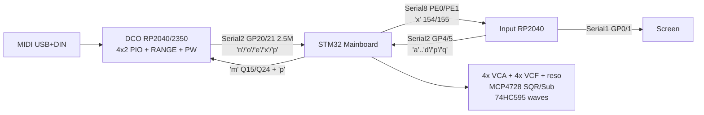

# DCO4-REBORN

Firmware for the **classic DCO4 analog polysynth**: **4 MIDI voices × 2 oscillators**, STM32 Mainboard as analog/modulation hub, DCO3 Q15/Q24 math and slim little-endian UART. MIDI stays on the DCO.

## Purpose

- **4 voices × 2 analog DCOs** (RANGE + PW PWM on the voice board)
- Frequency on **PIO** (RP2040 / RP2350)
- Envelopes, LFOs, mod matrix, VCA/VCF/reso CVs, MCP4728 SQR/Sub, 74HC595 waves on the **STM32 Mainboard**
- DCO3-quality MIDI allocator (last-note stack, full CC map, AT, PB) on the **DCO**

## Boards

| Board | Folder | MCU | Owns |
|-------|--------|-----|------|
| DCO | `DCO/` | RP2040 / RP2350 | MIDI, voice alloc, PIO pitch, RANGE/PW, amp-comp, autotune, Character, pitch drift |
| Mainboard | `MAINBOARD-CONTROLLER/` | STM32 | EnvVCA/VCF/DCO ×4, LFO1/2, matrix, analog CVs, Input/DCO UART hub |
| Input | `INPUT-CONTROLLER/` | RP2040 | Panel scan, presets, Screen UI frames |
| Screen | `SCREEN-CONTROLLER/` | RP2040 | LVGL UI |
| Voice aux | `VOICE-AUX/` | RP2040 | Optional Dist / filter-mode helper |
| Control panel | `DCO-CONTROL-PANEL/` | host (Linux) | USB bench GUI; shared submodule with DCO3-MONOSYNTH |

`INPUT-CONTROLLER/`, `SCREEN-CONTROLLER/`, `DCO-CONTROL-PANEL/` and
`DCO-PROTOCOL/` are shared with DCO3-MONOSYNTH — one repo, checked out into both
synths, byte-identical in each. They learn which instrument they are part of
from [`project_config.h`](project_config.h) at this root, read through a symlink
that resolves differently in each project, so no board has a per-project flag,
build script or hand-edited line. `PROJECT_INSTRUMENT 4` here is the single
declaration that this is the 4-voice synth.

Shared libraries: [`mo-lfo`](https://github.com/felipegaspari/mo-lfo) (Q15), [`ADSR_Bezier`](https://github.com/felipegaspari/ADSR_Bezier) (Q15), [`DCO_Noise`](https://github.com/felipegaspari/DCO_Noise). Topology: [`MAINBOARD-CONTROLLER/docs/MAINBOARD_REINTEGRATION.md`](MAINBOARD-CONTROLLER/docs/MAINBOARD_REINTEGRATION.md), [`DCO/docs/SYSTEM_OVERVIEW.md`](DCO/docs/SYSTEM_OVERVIEW.md).

## Architecture

| | Classic DCO4 wiring | Control model |
|--|---------------------|---------------|
| MCU (DCO) | RP2040 (2 PIO) or RP2350 | PIO pitch + MIDI |
| Voices | 4 × 2 osc | same |
| Modulation / analog CV hub | STM32 Mainboard | DCO3 Q15/Q24 bake-on-write |
| Amplitude | RANGE PWM | same |



## Build (DCO)

```bash
cd DCO
arduino-cli compile \
  --fqbn rp2040:rp2040:rpipico2:usbstack=tinyusb,flash=4194304_524288 \
  --libraries ./_build_libs \
  .
```

`flash=…_524288` gives the DCO a 512 KB LittleFS partition for the 256-slot MCU preset
store and calibration files (see `DCO/docs/PRESET_STORE.md`). Changing the FS size
reformats it — back up calibration/presets with `DCO/tools/dco_control` first.

Mainboard: STM32 Arduino sketch `MAINBOARD-CONTROLLER/MAINBOARD-CONTROLLER.ino`.

## Build (Input)

`INPUT-CONTROLLER/` is a **shared submodule**: the exact same commit runs the
panel on both DCO3-MONOSYNTH and this project (see
[`INPUT-CONTROLLER/README.md`](INPUT-CONTROLLER/README.md)). It knows which
synth it is building for from [`project_config.h`](project_config.h) at this
root, which it reads through a symlink, so no override is needed and there is
nothing to remember:

```bash
./scripts/build_input.sh          # wraps the arduino-cli call below
# or, equivalently:
arduino-cli compile --fqbn rp2040:rp2040:rpipico \
  --libraries ./INPUT-CONTROLLER/_build_libs \
  --build-property "compiler.cpp.extra_flags=-DROXMUX_FELA_SRAM_HOT=0" \
  ./INPUT-CONTROLLER
```

`PROJECT_INSTRUMENT 4` in that file is the one place this project declares what
it is; the Screen sketch and the control panel read it too. Never edit
`board_model.h` inside the submodule — it is identical to DCO3-MONOSYNTH's copy
and any local edit will be silently discarded the next time the submodule is
updated.

USB bench without the panel: [`DCO-CONTROL-PANEL/`](DCO-CONTROL-PANEL/README.md). MIDI CC map: [`DCO/docs/MIDI_CC_MAP.md`](DCO/docs/MIDI_CC_MAP.md).
