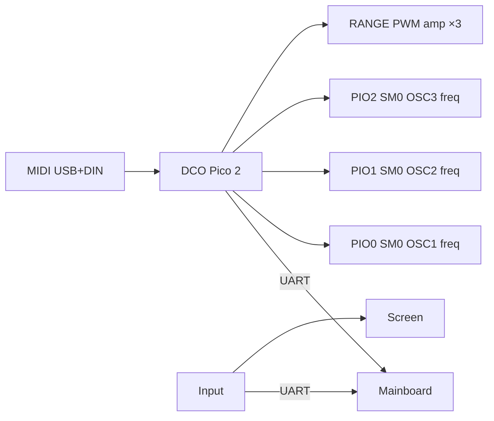

# DCO3-MONOSYNTH

A **3-oscillator monosynth** firmware project, forked from DCO4 (4-voice × 2-DCO digitally controlled analog synth). Same multi-board layout and ParamId/UART model; the DCO voice board is being retargeted to a **Raspberry Pi Pico 2 (RP2350)** monosynth architecture.

## Purpose

Build a fully digitally controlled analog monosynth with:

- **1 voice × 3 oscillators** (current hardware target)
- Frequency generation on **PIO** (one frequency SM per oscillator)
- **Amplitude compensation via hardware PWM** (same approach as DCO4 — not PIO)
- Preserved calibration, MIDI, modulation, and multi-board control from DCO4
- Scaffolding kept for a later **3-voice paraphonic** mode

## Boards

| Board | Folder | Role |
|-------|--------|------|
| DCO | `DCO/` | MIDI, voice engine, PIO DCOs, PWM range amp, calibration (Pico 2) |
| Mainboard | `Mainboard/` | ADSRs/LFOs, VCF/VCA/resonance CV, param hub |
| Input | `INPUT-CONTROLLER/` | Panel scan, presets, UART fan-out |
| Screen | `SCREEN-CONTROLLER/` | LVGL display |

Submodules live under this repo (see `.gitmodules`).

## Architecture vs DCO4

| | DCO4 | DCO3-MONOSYNTH (now) |
|--|------|----------------------|
| MCU (DCO) | RP2040 (2 PIO blocks) | **RP2350 Pico 2 (3 PIO blocks, 12 SMs)** |
| Voices | 4 | **1** (`NUM_VOICES_TOTAL = 1`) |
| Oscillators | 8 (2 per voice) | **3** |
| Freq SMs | PIO0/1, SM0–3 | **PIO0/1/2 SM0** (one PIO block per osc) |
| Amplitude | Hardware PWM (`RANGE`) | **Hardware PWM (`RANGE`) — kept as-is** |
| Voice modes | Mono / poly / unison | Allocator + `setVoiceMode` **kept**; effective polyphony still 1 |



## Changes so far (DCO submodule)

Work is on DCO branch **`autotune-improvements`** (not the older `improvements` tree). Mainboard / Input / Screen are still DCO4-era.

### Voicing & PIO

- `NUM_VOICES_TOTAL = 1`, `NUM_OSCILLATORS = 3`
- `pio[3] = {pio0, pio1, pio2}`; freq SMs on `VOICE_TO_SM = {0,0,0}`
- `voice_task` / simple / debug paths drive OSC1–3 (`DCO_A` / `DCO_B` / `DCO_C`)
- OSC3 mirrors OSC2-style interval + fine detune; sync OSC1↔OSC2; OSC3 free-running
- Sketch renamed `DCO4_DCO.ino` → `DCO.ino`
- Per-oscillator **RANGE PWM** amplitude compensation unchanged in approach (tables + `pwm_set_chan_level`)

### Multivoice scaffolding (kept on purpose)

- Full `get_free_voice_sequential()` and `setVoiceMode()` restored
- Default `voiceMode = 1` (poly semantics when voice count rises later)
- Fixed osc indices `0/1/2` on voice 0 today; future paraphonic mode will remap osc ownership, not gut allocation

### Detune / OSC3 control

- `voice_task_simple` assigns pitch from tables only (`freq2` / `freq3` without float detune multiply)
- Fine detune stays in the main Q24 `voice_task` path (`detune_q24` / `detune3_q24`)
- DCO accepts `PARAM_OSC3_INTERVAL` (33), `PARAM_OSC3_DETUNE_VAL` (34), `PARAM_LFO2_TO_DETUNE3` (35)
- ADSR→pitch select: 0=OSC1, 1=OSC2, 2=OSC1+OSC2, 3=OSC3, 4=all
- Per-osc unison steps `0, +1, -1` on OSC1/2/3

### Build

```bash
cd DCO
arduino-cli compile \
  --fqbn rp2040:rp2040:rpipico2:usbstack=tinyusb \
  --libraries ./_build_libs \
  .
```

## Not done yet

- ParamIds / UI on Mainboard / Input / Screen for OSC3 (DCO already accepts OSC3 params)
- True 3-voice paraphonic note→osc assignment
- Final PCB pinout confirmation (provisional map in `globals.h` uses first 3 oscs of legacy WEACT DCO4)
- Remaining PIO SMs unused for now (reserved for later features, not amplitude)

## Docs

- DCO board: [`DCO/README.md`](DCO/README.md)
- Upstream DCO4 architecture: see `DCO4_DCO/docs/SYSTEM_OVERVIEW.md` in the DCO4 tree
