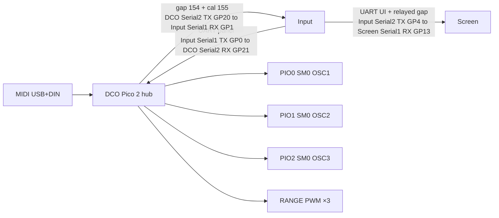

# DCO4-REBORN

A **3-oscillator monosynth** firmware project, forked from DCO4. The DCO voice board runs on a **Raspberry Pi Pico 2 (RP2350)** and is also the **serial hub** (Input + Screen). The STM32 Mainboard is **archived**.

## Purpose

- **1 voice × 3 oscillators**
- Frequency on **PIO** (one freq SM per oscillator)
- Amplitude compensation via **RANGE PWM**
- Envelopes (EnvDCO / EnvVCA / EnvVCF), LFOs, and filter/VCA CV math on the DCO
- Scaffolding for a later **3-voice paraphonic** mode

## Boards (shipping = 3)

| Board | Folder | GitHub repo |
|-------|--------|-------------|
| DCO | `DCO/` | [`DCO4-REBORN-DCO`](https://github.com/felipegaspari/DCO4-REBORN-DCO) |
| Voice aux | `VOICE-AUX/` | [`DCO4-REBORN-VOICE-AUX`](https://github.com/felipegaspari/DCO4-REBORN-VOICE-AUX) |
| Input | `INPUT-CONTROLLER/` | [`DCO4-REBORN-INPUT-CONTROLLER`](https://github.com/felipegaspari/DCO4-REBORN-INPUT-CONTROLLER) |
| Screen | `SCREEN-CONTROLLER/` | [`DCO4-REBORN-SCREEN-CONTROLLER`](https://github.com/felipegaspari/DCO4-REBORN-SCREEN-CONTROLLER) |
| ~~Mainboard~~ | [`_archived/Mainboard/`](_archived/Mainboard/) | [`DCO4-REBORN-MAINBOARD`](https://github.com/felipegaspari/DCO4-REBORN-MAINBOARD) |

Shared libraries (submodules): [`mo-lfo`](https://github.com/felipegaspari/mo-lfo) (`q15`), [`ADSR_Bezier`](https://github.com/felipegaspari/ADSR_Bezier) (`Q15`), [`DCO_Noise`](https://github.com/felipegaspari/DCO_Noise). Full pin list: `.gitmodules`. Overview: [`DCO/docs/SYSTEM_OVERVIEW.md`](DCO/docs/SYSTEM_OVERVIEW.md).

## Architecture vs DCO4

| | DCO4 | DCO4-REBORN (now) |
|--|------|----------------------|
| MCU (DCO) | RP2040 (2 PIO) | **RP2350 Pico 2 (3 PIO)** |
| Voices | 4 | **1** |
| Oscillators | 8 | **3** |
| Modulation / CV hub | STM32 Mainboard | **DCO** (Mainboard archived) |
| Amplitude | RANGE PWM | **RANGE PWM** |



## Build (DCO)

```bash
cd DCO
arduino-cli compile \
  --fqbn rp2040:rp2040:rpipico2:usbstack=tinyusb \
  --libraries ./_build_libs \
  .
```

The DCO has one peer link: its Serial2 (GP20 TX / GP21 RX) against the Input's Serial1 (GP0 TX / GP1 RX). The Input drives the Screen from its other UART, Serial2 TX (GP4), and relays the calibration gap there, so there are no serial topology flags to set.

## Driving the DCO without the panel

Two ways, both reaching the whole control surface with no Input board or Screen attached:

- [`DCO/tools/dco_control/`](DCO/tools/dco_control/README.md) — a Linux GUI over USB serial
- [`DCO/docs/MIDI_CC_MAP.md`](DCO/docs/MIDI_CC_MAP.md) — every control on a 7-bit MIDI CC, for a DAW or a panel app, with a generated Open Stage Control session in `DCO/tools/panels/`

Living checklist: [`TODO_3OSC_MIGRATION.md`](TODO_3OSC_MIGRATION.md).
