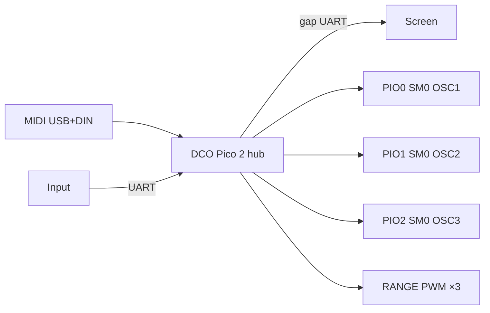

# DCO3-MONOSYNTH

A **3-oscillator monosynth** firmware project, forked from DCO4. The DCO voice board runs on a **Raspberry Pi Pico 2 (RP2350)** and is also the **serial hub** (Input + Screen). The STM32 Mainboard is **archived**.

## Purpose

- **1 voice × 3 oscillators**
- Frequency on **PIO** (one freq SM per oscillator)
- Amplitude compensation via **RANGE PWM**
- Envelopes (EnvDCO / EnvVCA / EnvVCF), LFOs, and filter/VCA CV math on the DCO
- Scaffolding for a later **3-voice paraphonic** mode

## Boards (shipping = 3)

| Board | Folder | Role |
|-------|--------|------|
| DCO | `DCO/` | MIDI, voice engine, envs/LFOs, hub UARTs, cal, opt-in CV outs (Pico 2) |
| Input | `INPUT-CONTROLLER/` | Panel scan, presets → DCO |
| Screen | `SCREEN-CONTROLLER/` | LVGL display; gap from DCO |
| ~~Mainboard~~ | [`_archived/Mainboard/`](_archived/Mainboard/) | Archived STM32 peer |

Submodules: see `.gitmodules`. Overview: [`DCO/docs/SYSTEM_OVERVIEW.md`](DCO/docs/SYSTEM_OVERVIEW.md).

## Architecture vs DCO4

| | DCO4 | DCO3-MONOSYNTH (now) |
|--|------|----------------------|
| MCU (DCO) | RP2040 (2 PIO) | **RP2350 Pico 2 (3 PIO)** |
| Voices | 4 | **1** |
| Oscillators | 8 | **3** |
| Modulation / CV hub | STM32 Mainboard | **DCO** (Mainboard archived) |
| Amplitude | RANGE PWM | **RANGE PWM** |



## Build (DCO)

```bash
cd DCO
arduino-cli compile \
  --fqbn rp2040:rp2040:rpipico2:usbstack=tinyusb \
  --libraries ./_build_libs \
  .
```

Default build enables Input + Screen hub. Legacy Mainboard: `#define ENABLE_LEGACY_MAINBOARD_LINK` in `DCO.ino`.

Living checklist: [`TODO_3OSC_MIGRATION.md`](TODO_3OSC_MIGRATION.md).
